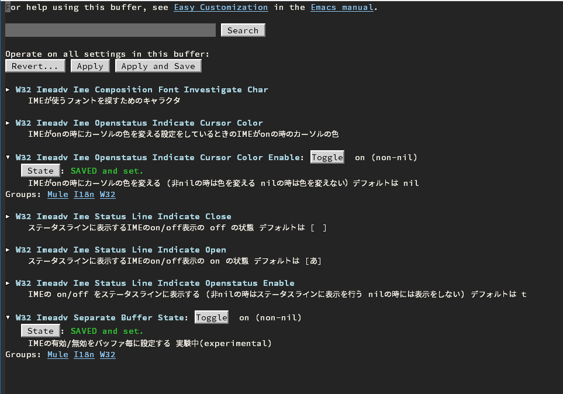

# 2022-03-04 現在

29.0.50 開発版での現象 lisp-w32-imeadv.el の中で
```
(setq-default mode-line-format (cons '(:eval (w32-imeadv-status-line-show)) mode-line-format))
```
でモードラインの変更を行うと、
```
bidi.c:2924: Emacs fatal error: assertion failed: bidi_it->prev_for_neutral.type != UNKNOWN_BT
```
のアサーションで Emacsが落ちるので無効に変更してあります。


# w32-imeadv (experimental implementation : 実験的実装)

IMM32 dynamic module for Emacs on Windows

これまで、EmacsでIMM32（とIME）を実用的に使用するためには複雑なパッチを当てる作業を行っていたが、
この作業は煩雑で注意が必要な作業であった。

このパッチ当ての作業を簡素化するために、Dynamic Module を利用したコードを書き下ろすことにした。

このダイナミックモジュールは、26.1 で作られ 現在 28.0.50(開発版、素の GNU Emacs 版パッチ無し）でテストしている最中である。
特にダイナミックモジュール導入後の25系は、emacs-module.h を入れ替えればよいのであるが、していない。
そちらは既にIMEパッチの当たったNTEmacs64等があるので、検討を願いたい。

また、ダイナミックモジュールによる同様の試みとして [tr-emacs-ime-module](https://github.com/trueroad/tr-emacs-ime-module)があります。
そちらは、w32-ime.elをほとんどそのまま使える上に、バイナリのリリースもあります！

# 使い方
 Dynamic moduleを使っているので、  --with-modules をつけてコンパイルした Emacs を用意する。
 
 [w32-imm32-on-start-enabler](https://github.com/maildrop/w32-imm32-on-start-enabler) を入れる。

 本プロジェクトををビルドして作ったファイル 
- w32-imeadv.dll

 を、これは $(PREFIX)/share/emacs/26.1/site-lisp に配置 これが dynamic module 本体になります

 あとは、追加のサンプルに、lisp-w32-imeadv.el があるのでどうにかする。

```
(when (equal system-type 'windows-nt)
  ;; Emacs のバグに対応させるダイナミックモジュール
  (when (and (locate-library "w32-imm32-on-start-enabler" )
             (load "w32-imm32-on-start-enabler") )
    (w32-imm32-on-start-enabler-inject))
  ;; w32-imeadv の有効化
  (when (and (locate-library "w32-imeadv")
             (locate-library "lisp-w32-imeadv"))
    (load "lisp-w32-imeadv")))
```

## カスタマイズ


M-x customize でいくつかのカスタマイズ項目が設定出来ます。IMEがonの時にカーソルの色を変えたりステータスラインの表示をon/offしたりできます。

### インジケータ
 ステータスラインに、IMEの状態を表示するかどうかが選べます 
 on の場合は `[あ]` off の場合は`[　]` が表示されます。

### フォント

恐らく弄る必要はありません。自然な感じでフィットすると思います。

w32-imeadv は現在のカーソルがポイントしているfaces でひらがなの「あ」を描画する時に使うフォントを自動で選択します。これにより、描画される文字サイズが変更になっても追従します。
このときにひらがな以外を基準に使いたい場合は W32 Imeadv Ime Composition Font Investigate Charに指定して下さい。（多分要らない）

IMEが使用するフォントを指定したい場合 w32-imeadv-ime-composition-font-attributesが 非nilならばそれをそのまま使おうとします。

w32-imeadv-ime-composition-font-attributes が nil の場合は カーソルの場所のfacesを取得し、そのfacesのフォントを選択し、
font-attributes に設定します。

そしてフォントの選択が終わった後に フック関数 w32-imeadv-composition-font-hook が呼ばれます。
font-attributes を変更したい時には、このフック関数で変更することが出来ます。

(w32-imeは IMEが使用するフォントを frame parameters の ime-font に指定してました。これが w32-imeadv-composition-font-attributeに相当します。)

w32-imeadv--notify-composition-font がコンポジションフォントを選択する関数です。

## 操作及びフック
w32-imeadv は mule-cmd.el をベースにしています。

このために、 関数activate-input-method で IMEが on になり フック関数input-method-activate-hook が呼ばれます。

# 目標

「できるだけ」GNU 配布のソースを --with-modules でコンパイルしただけで使えるようにすること。

- ほとんどのWM_IME_ 周りのコードを、WindowsXP 以降で利用可能になった SetWindowSubclass でサブクラス化することにより行う。
- GNUのコードをできるだけそのままにする。
- Dynamic Module を起点として、 Emacs Lisp の S式を直接呼び出すことはサポートされないので、一旦外部プロセスを経由した、Self-Pipe-Trick を使い、フィルター関数を経由して再度 Dynamic ModuleのS式を呼び出すことにした。

# 注意

- まだ、abort の可能性があります。

- まだ、デットロックの可能性が排除しきれていない。(多分大丈夫になりました）

再変換時にフリーズする場合があったが、これは SendMessage() のメッセージ伝播がうまくなかったことが原因のうちの一つだったので、修正されました。ただし、全ての可能性が排除できたわけでは無いので、まだ不安であります。

- デットロック解除用に 5sec 閾値のタイムアウトを設定しているので、画面がフリーズしたと思ったら、IME制御の状態がおかしくなっているとご理解ください。その場合、できるだけ早くセーブ終了をして作業結果の保全をお願いします。

- 現在 ad-hoc な方法で Ctrl-x 押下時に、IME を offにしています。「正しい方法」を知りたい

現在ウィンドウプロシージャ側で、 Ctrl-x 押下時に、IME を offにするコードが入っています。

本来は、input-sequence が入力途中の状態の時（ミニバッファに C-x とか表示されている時）から、pre-command-hook が実行される時まで
IME を一時的に off にするというのが正しい挙動になると思います。 このinput-sequence が入力途中 というのを Lisp コードから判定するフックを求めています。

この機能は現在切ることができません。

- ATOK, Google-IME 等(MS-IME以外）での input method editor の確定アンドゥ(Ctrl-Backspace)の挙動がよろしくありません。

ATOK,Google-IME等は、確定アンドゥの際に Ctrl-Backspace を削除する文字数分送ってきます。（MS-IMEはこの時にCtrlキーを解除してから、Backspaceを送ってきます。）Emacsは、このキーをワード単位のバックスペースに割り当てていますから、確定アンドゥで文字を消しすぎるという問題が起きます。
 なお、MS-IMEは、確定アンドゥができない場合には正しく Ctrl-Backspaceを送ってきますが、ATOKはCtrl-Backspaceで確定アンドゥに入ったまま、何も送ってきません。(つまりCtrl-Backspace でIME の status が open になるだけです）
 この挙動により、ATOK,Google-IME等を使用している際は、アプリケーションのショートカットキーとして、Ctrl-backspace を使用すること自体が困難なので、Emacs側でCtrl-backspaceのキーバインドを変更しておく方法が考えられます。

- ATOK で、 Ctrl-backspace の確定アンドゥをすると、emacs がフリーズします。ウィンドウのタイトルバーをもって揺らすと、復帰します。なんらかのバグだと思いますが、原因を追い切れていません。

ATOK の確定アンドゥ時には、WM_NULLのウィンドウメッセージが飛んでくることが判明しました。これは w32-imm32-on-start-enabler を使用する事で改善することができます。

- 異字体セレクタがまだ実装できていません。

## TODO
- インクリメンタルサーチ時に、minibuffer 上で変換するようにする。
- 再変換時にリージョン選択されている時は、そのリージョンを再変換に選ぶようにする。
- ATOK の 確定アンドゥがフリーズする問題への対応( w32-imm32-on-start-enabler へ )

- 以下優先度低め
 - 異字体セレクタを考慮すること
 - 互換用の w32-ime.el の作成？ 必要？ （これは Lisp に精通する必要があるので遅れる）
 - daemon mode で立ち上げた場合に、どうするのかを考える（これは後回し）

## BUG
- そもそも、まだ「動いた」のレベルである。
- 現在 27.0.50 で、2018-12-22 からドッグフード化させている最中
- 以下の遅い件について process-adaptive-read-buffering の設定をしていると遅くなる模様 試しにadaptive に変えてみたら軽快になった。
- DOCUMENTFEED が遅い。びっくりするぐらい遅い。長い行だとびっくりするぐらい遅い。
- 大きなフォントを使用すると、MS-IME はコンポジションウィンドウが遅い ATOKは大丈夫っぽい
 もう少しフォントの設定部分を煮詰める必要があると思う。常識的なフォントサイズなら許容範囲内の模様である。

## できたこと
- 素のGNU Emacs にダイナミックモジュールを適用して、IME制御を行うこと
- WM_IME_ 及びその他のウィンドウメッセージを収奪
- S式へのIMEからの Open/Close 通知
- S式からIMEの Open/Close 制御
- S式へのIMEからのフォント要求通知
- S式からのフォントの設定 (S式へのIMEからのフォント要求通知 からの組み合わせで、現在のface のフォント情報を利用して設定できるようになった)
- 再変換機能ののコード追加
- DocumentFeed 機能のコード追加
- 開いた・閉じたの通知は来るので、mode line をアップデートするように lisp コードを書くこと
- after-make-frame-functions フックを使ってフレーム作成毎に、w32-imeadv-inject-control するようにした。
- 本体のemacs.exe が異常終了したときに、emacs-imm32-input-proxy.exe が残ってしまうので、emacs.exe のプロセスハンドルを開いてMsgWaitForMultipleObjectsで待つように変更すること。
- emacs-imm32-input-proxy.exe を rundll32.exe を使って、dll として導入を図ること。
（そうすれば普通に単一のdllファイルで、w32-imeadv.dll だけで処理できるようになる）
- IMMがオープン中にカーソルの色を変える機能を追加する (多分 Lisp だけでいけるはず・・？)
- register-input-method で W32-IMEADV が登録されるようになりました。 Ctrl-\ でIMEのon-off ができます
- デバッグログは、マクロNDEBUG が定義されているときは出力されないように変更されました。そして、デフォルトの指示はNDEBUG にする
- UIからデフォルトフォントを変更した後、最初の変換ではフォントの指定が上手くいっていなかった問題に対処した
  この問題は、IMEを開いた状態でデフォルトフォントを変更すると、WM_IME_STARTCOMPOSITIONが送られないのでIMEのフォントを変更するようになっていない問題があった。このために、WM_IME_COMPOSITIONでフォントの指定を指示するようにすると共に、フォントの指定そのものは同期メソッドである必要が無いのでLispスレッドへはPostMessageでメッセージを投げるようにして対応してみた。
- Google日本語入力での確定アンドゥ時に Ctrl-Backspace でemacs がアグレッシブに消していく問題に対応

## 修正済み
- SpaceEmacs で それなりにうごくらしいように current-input-mehtod-title を設定してやるように変更
- バッファを新しく作成すると、IMEの状態を指示する変数が正しく設定されなかったので、deactivate-input-method: Symbol’s function definition is void: nil のメッセージが出てIMEの操作ができなくなっていた。これに対応するために、IMEのon/off時のフックですべてのバッファに同期をすること、新しくバッファが作られてバッファリストが更新されたときに、すべてのバッファに対して同期することのコードを追加した。
- フレームが作られると、カーソルの色の設定が正しくなくなることがある。カーソルも set-cursor-color で指定したが、これは現在のフレームに対してのみ作用するので、フレームをまたぐと上手く動作しなかった。これに対応するために、すべてのフレームを巡回するように変更した。
- まだ、wait message が timeout する場合がある。原因は調査中だが WM_IME* 周りのメッセージが PostMessage で送られてきているのかも知れない。メッセージの待機処理をもう少し練る必要がある。 これは Windows via C/C++ に書いてあったので「正しい」処理に変更した。
	-「正しい処理」とは別に、SendMessageで送られてきたメッセージの回数を数え上げるところで、最初のSendMessageのブロック中にSendMessage が戻される場合があり、回数を正しく数えていなかった。

## Dynamic Module では実現不可能な内容
- Lispスレッドのコモンダイアログを開くコードが、 UI ウィンドウを親として開くために一時的にロック（本来はデットドック）後タイムアウトをまでブロックする問題（GNUEmacsBug11732)

本件については、参考情報として、https://github.com/maildrop/GNUEmacsBug11732 があります。 Dynamic Module では、解決することが難しそうです。

- 右下通知領域の IME アイコン の制御は、WM_TIMERのスレッドメッセージ( HWND == nullのメッセージのこと ) が処理しているので、これを修正するためにはメッセージポンプ の スレッドメッセージを Dispatch しない とする部分の修正が必要 （実はメッセージフックで解決可能の道が開かれた？ 要調査）

本件については、 https://github.com/maildrop/w32-imm32-on-start-enabler の Dynamic Module で軽減できそうです。

## 感想
Mircrosoft Windows のフック関数の有能さに救われている。
これは感想の範囲を超えないが、DOCUMENTFEED は切れるようにしておいたほうが、使用感は良いかもしれない。
